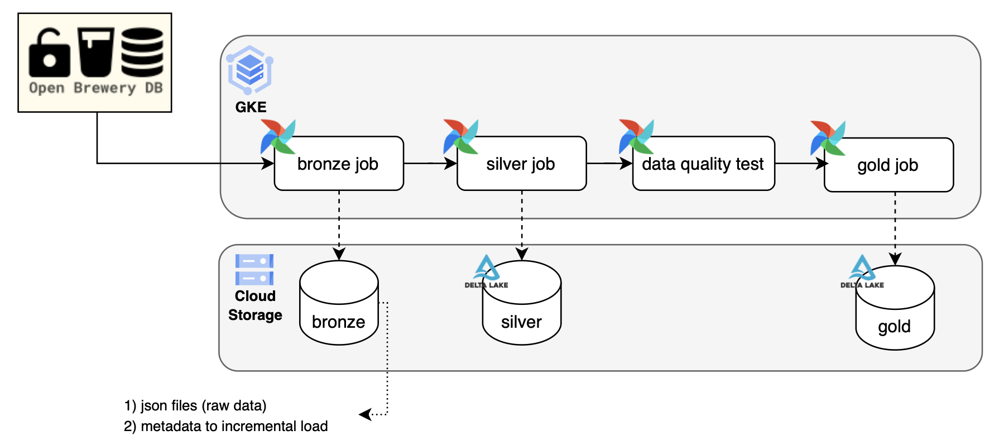

# Architecture Overview

The **Breweries Case** platform is built on a layered Data Lakehouse architecture, leveraging Google Cloud Platform (GCP) services to provide a scalable, reproducible and robust data processing environment.

    

## Data Lakehouse Layers

The project follows the Medallion architecture, organizing data into three distinct layers:

1.  **Bronze (Raw)**:
    *   **Source**: Open Brewery DB API.
    *   **Format**: Raw JSON files.
    *   **Storage**: Google Cloud Storage (`gs://bees-storage/bronze/data/`).
    *   **Strategy**: Ingests data in its original format. Now uses timestamped subfolders (e.g., `YYYY_MM_DD_HH_MM_SS_ffffff`) for better organization and traceability.

2.  **Silver (Curated)**:
    *   **Format**: Delta Lake (ACID-compliant).
    *   **Storage**: Google Cloud Storage (`gs://bees-storage/silver/`).
    *   **Role**: Applies schema enforcement, deduplication and casts data types. Uses an **Upsert (Merge)** pattern to maintain a clean, stateful representation of breweries. Partitioned by `country`, `state` and `city`.

3.  **Gold (Analytical)**:
    *   **Format**: Delta Lake.
    *   **Storage**: Google Cloud Storage (`gs://bees-storage/gold/`).
    *   **Role**: Contains aggregated and optimized data for analytics and business intelligence queries.

## Technology Stack

### Infrastructure
*   **Google Kubernetes Engine (GKE)**: Orchestrates the platform's workloads.
*   **Google Cloud Storage (GCS)**: Scalable object storage for all data layers and Airflow logs/DAGs.
*   **Artifact Registry**: Hosts container images for ETL jobs and Airflow.
*   **Terraform**: Manages infrastructure-as-code for consistent resource provisioning.

### Orchestration & Processing
*   **Apache Airflow**: Coordinates the end-to-end pipeline, running on GKE.
*   **Apache Spark**: Powers the distributed processing for Silver and Gold layers.
*   **Spark Operator**: Manages Spark applications natively on Kubernetes.
*   **Delta Lake**: Provides ACID transactions and scalable metadata handling for Spark.

### Data Quality
*   **PyDeequ**: Unit testing for data, validating schema, completeness and integrity between layers.

## High-Level Workflow

1.  **Infrastructure Provisioning**: Terraform sets up the GCP resources.
2.  **Project Initialization**: The `start.sh` script configures the environment, builds images and deploys Airflow/Spark.
3.  **Data Ingestion**: Airflow triggers the Bronze pipeline to pull data from the API.
4.  **Transformation**: Spark jobs (Silver) process raw data and upsert into Delta tables.
5.  **Validation**: PyDeequ tests verify data quality.
6.  **Aggregation**: Spark jobs (Gold) create analytical datasets.

## Design Decisions & Trade-offs

| Decision | Rationale | Trade-offs |
|----------|-----------|------------|
| **Medallion Architecture** | Clear separation of concerns and data quality stages. | Increased storage and ETL complexity. |
| **Delta Lake on GCS** | ACID transactions and scalable metadata. | Requires Spark/Delta-compatible tools. |
| **GKE Orchestration** | Scalability, isolation and cloud-native management. | Higher operational overhead than simpler solutions. |
| **Airflow on K8s** | Industry standard for complex scheduling and monitoring. | Requires cluster management. |
| **PyDeequ Validation** | Distributed data quality checks integrated with Spark. | Limited to Spark-based workloads. |
