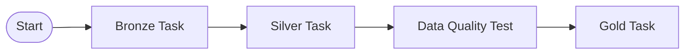

# Orchestration

The **Breweries Case** pipeline is orchestrated using **Apache Airflow** deployed on a Google Kubernetes Engine (GKE) cluster.

## Deployment Model

*   **Platform**: GKE (Google Kubernetes Engine).
*   **Helm**: Airflow is deployed using the official Helm chart (`apache-airflow`).
*   **In-Cluster Execution**: Tasks are executed as Kubernetes Pods or Airflow-native functions within the cluster.
*   **Database**: PostgreSQL is used as the metadata database for Airflow.
*   **Security**: Workload Identity is used to allow Airflow pods to securely access GCP resources (GCS, etc.) without needing static service account keys.

## Data Pipeline DAG

The main workflow is defined in `src/pipeline/dag.py` (`data-pipeline-breweries`).

### Workflow Structure

The pipeline follows a linear path across the data layers:

### Task Types

1.  **Bronze Task**:
    *   **Implementation**: Airflow-native `@task` (PythonOperator).
    *   **Logic**: Ingests data from the API and saves it directly to GCS.
    *   **Security**: Configured with `executor_config` to specifically use `airflow-service-account`, ensuring it has the necessary GCP permissions via Workload Identity.
2.  **Silver, Gold and Quality Tasks**:
    *   **Implementation**: `SparkKubernetesOperator`.
    *   **Logic**: Triggers a Kubernetes custom resource (`SparkApplication`) managed by the Spark Operator. This allows for high-performance, distributed Spark jobs while keeping Airflow as the lightweight orchestrator.

## Configuration

*   **Connection**: Uses a Kubernetes cluster connection (`in_cluster_configuration_kubernetes_cluster`) to communicate with the GKE API.
*   **Images**: Specialized Docker images for each layer (Silver, Gold, Tests) are stored in the Google Artifact Registry and referenced in the DAG.
*   **Secrets**: Image pull secrets and service account annotations ensure secure access across namespaces.
